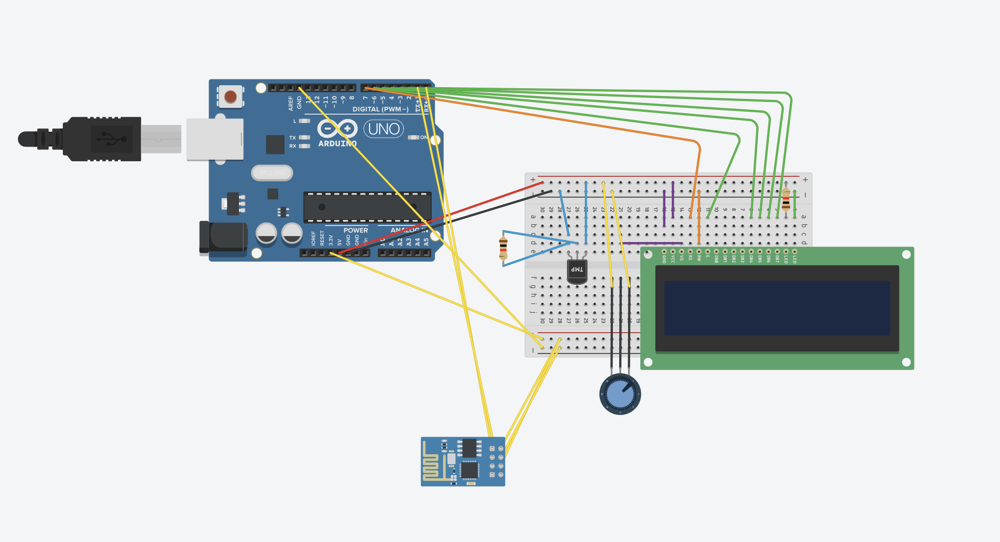
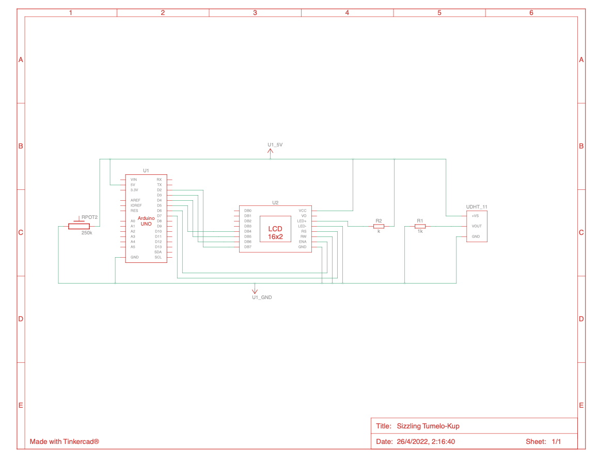
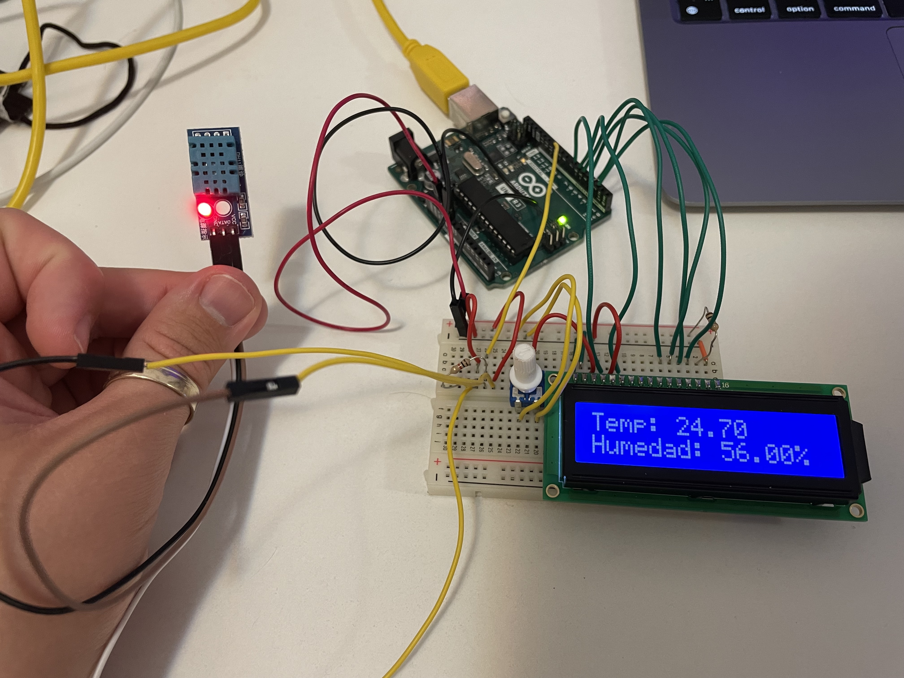
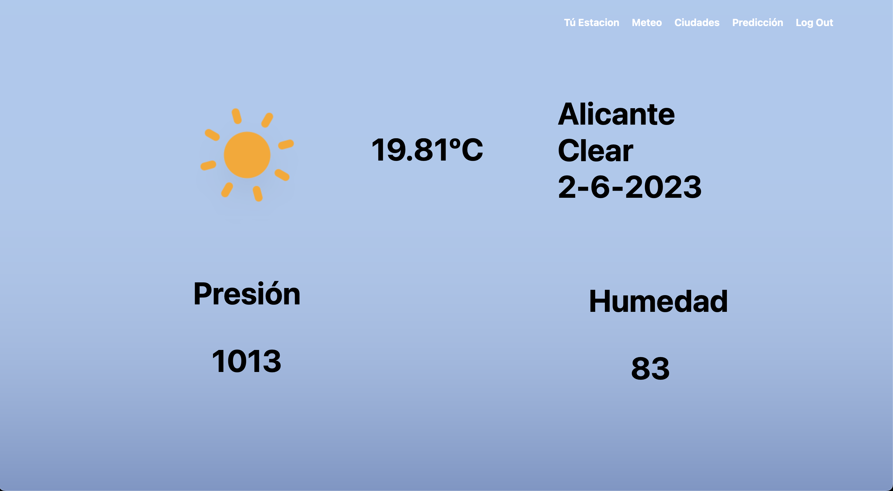
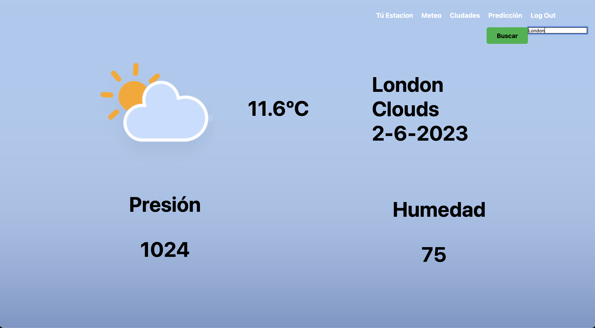

## Weather Station Arduino and WebPage connected to API ☁️

I am pleased to present a personal project, I have assembled an Arduino with a weather data receiver and a web page to query the weather data.

## Table of contents

* [Technologies](#technologies)
* [Circuit](#circuit)
* [WebPage](#webpage)
* [References](#references)
* [Credits](#credits)

## Technologies 

In this part, we will explain how we have built the weather station prototype, the components, the circuit view, the schematic view, the prototype result and future implementations.

##### Weather Station

- <strong>Arduino IDE 1.8.19:</strong> Open source Arduino software that makes it easy to write code and upload it to the board.

- <strong>C++:</strong> language used to program the Arduino board; this language consists of an adaptation from avr-libc that provides a C library for use in microcontrollers.

- <strong>ESP8266 wifi and DHT11 modules:</strong> modules installed on the Arduino board that will allow us to connect to the wifi network and collect weather information. In the next point of the work we will explain in more detail these components and how we have worked with them.

##### Webpage

- <strong>HTML:</strong> we use this language to define the structure of our website.

- <strong>CSS:</strong> thanks to this language we can add graphical enhancements to our website.

- <strong>JavaScript:</strong> programming language we use to add interactive features to our website.

- <strong>OpenWeatherMap API:</strong> we use a free version of the API provided by the openweather.org website.

## Circuit
##### Components

- <strong>Arduino Uno:</strong> this will be the board on which the whole station will be installed.

- <strong>LCD screen:</strong> LCD screen that allows us to show the information in real time; in our case we will show the humidity and temperature. our case we will show the humidity and temperature.

- <strong>Temperature sensor DHT11:</strong> this module will allow us to capture the humidity and temperature of the environment.

- <strong>ESP8266:</strong> wifi module that allows us to access the internet and send the information obtained by the DHT11 module to the web page.

  
  
|  Name | Amount | Component |
|:----------:|:----------:|:----------:|
| U1    | 1   |Arduino R3 |
| U2    | 1   |LCD 16 x 2 |
| Rpot2    | 1   |250k&Omega; Potentiometer |
| DHT11   | 1   |Temperature sensor |
| R1    | 1   | &Omega; Resistance|
| R2    | 1   | &Omega; Resistance |
| U3  | 1   | Wifi (ESP8266) |
  

##### Circuit Simulation

##### Schematic view

##### Results

## WebPage

## References

* [OpenWeather.org](https://openweathermap.org/current) - API Weather
* [DHT 11 Guide](https://randomnerdtutorials.com/complete-guide-for-dht11dht22-humidity-and- temperature-sensor-with-arduino/) - Guide for DHT 11 Humidity and Temperature Sensor With Arduino
* [Wifi Module](https://www.microchip.ua/wireless/esp01.pdf) - ESP-01 Wifi Module

## Credits

			

